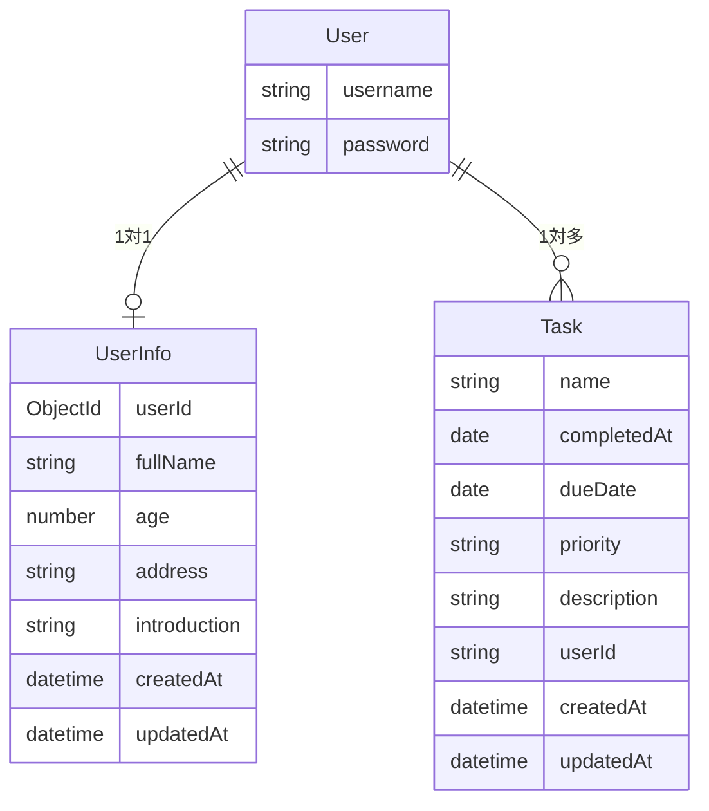

# ＥＲ図

以下は本システムのエンティティ・リレーション図（ER図）です。

```mermaid
erDiagram
    User {
        string username
        string password
    }
    UserInfo {
        ObjectId userId
        string fullName
        number age
        string address
        string introduction
        datetime createdAt
        datetime updatedAt
    }
    Task {
        string name
        date completedAt
        date dueDate
        string priority
        string description
        string userId
        datetime createdAt
        datetime updatedAt
    }

    User ||--o| UserInfo : "1対1"
    User ||--o{ Task : "1対多"
```

- User と UserInfo は 1対1 の関係です。
- User と Task は 1対多 の関係です。
- UserInfo の userId は User の _id を参照します。
- Task の userId は User の _id を参照します。 